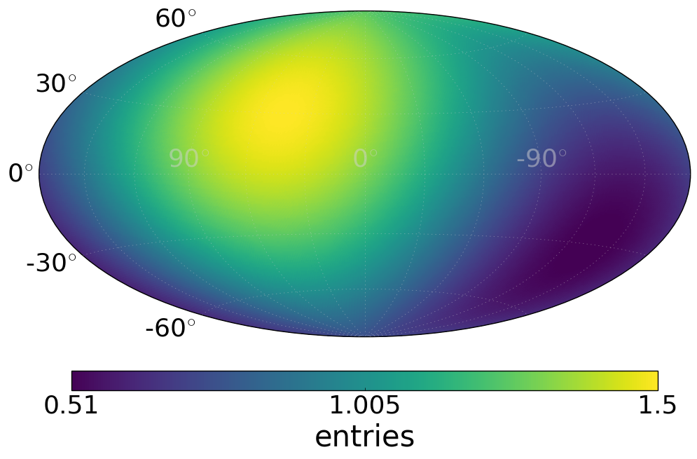
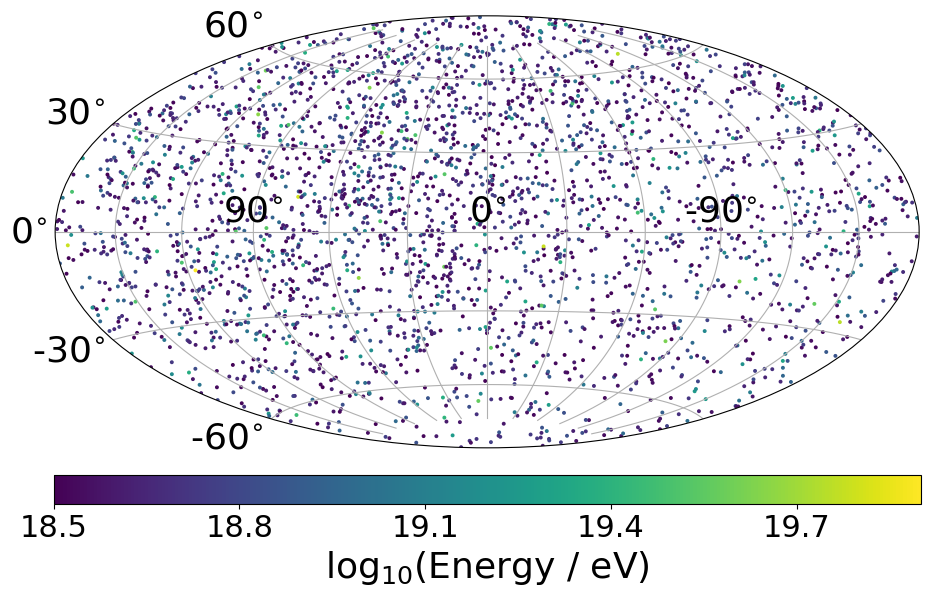
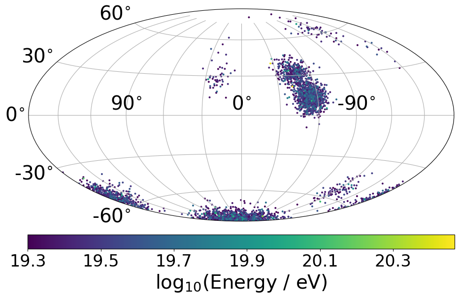

===================
Astrotools tutorial
===================

This tutorial is meant to give a short overview about the different functionalities
of the astrotools modules.

Module: coord.py
================
This modules converts between different coordinate systems.
The following code snippet will show some basic setup of isotropic arrival
directions in galactic coordinate system.

We create an isotropic arrival map and convert galactic longitudes (lons) and
galactic latitudes (lats) into cartesian vectors.

.. code-block:: python

  from astrotools import auger, coord, skymap
  ncrs, emin = 3000, 18.5            # number of cosmic rays
  lons = coord.rand_phi(ncrs)        # isotropic in phi (~Uniform(-pi, pi))
  lats = coord.rand_theta(ncrs)      # isotropic in theta (Uniform in cos(theta))
  vecs = coord.ang2vec(lons, lats)   # or better directly: coord.rand_vec(ncrs)
  # Plot an example map with sampled energies. If you specify the opath keyword in
  # the skymap function, the plot will be automatically saved and closed
  log10e = auger.rand_energy_from_auger(n=ncrs, log10e_min=emin)
  skymap.scatter(vecs, c=log10e, opath='isotropic_sky.png')

In the following code we create an arrival map with a source located at
v_src=(1, 0, 0) and apply a fisher distribution around it with gaussian spread
sigma=10 degree

.. code-block:: python

  import numpy as np
  import matplotlib.pyplot as plt
  v_src = np.array([1, 0, 0])
  kappa = 1. / np.radians(10.)**2
  vecs = coord.rand_fisher_vec(v_src, kappa=kappa, n=ncrs)
  # if you dont specify the opath you can use (fig, ax) to plot more stuff
  fig, ax = skymap.scatter(vecs, c=log10e)
  plt.scatter(0, 0, s=100, c='red', marker='*')    # plot source in the center
  plt.savefig('fisher_single_source_10deg.png', bbox_inches='tight')
  plt.close()

We can also use the coord.rand_fisher_vec() function to apply an angular uncertainty
on simulated arrival directions by feeding a higher dimensional v_src in shape (3, ncrs).
Each cosmic ray can also have a separate smearing angle, in the following code snippet
increasing with the longitude.

.. code-block:: python

  lats = np.radians(np.array([-60, -30, -15, 0, 15, 30, 60]))
  lons = np.radians(np.arange(-180, 180, 30))
  lons, lats = np.meshgrid(lons, lats)
  # vectors on this defined grid:
  vecs = coord.ang2vec(lons.flatten(), lats.flatten())
  # chose longitude dependent uncertainty
  sigma = 0.01 + np.abs(lons.flatten()) / (4 * np.pi)
  vecs_unc = coord.rand_fisher_vec(vecs, kappa=1/sigma**2)
  skymap.scatter(vecs_unc, s=100, c=sigma, cblabel=r'$\sigma$ [rad]')
  # To have the reference points we will also visualize the grid (Take care about the different longitude convention here)
  plt.scatter(-lons.flatten(), lats.flatten(), marker='+', color='k')
  plt.savefig('angular_uncertainty.png', bbox_inches='tight')
  plt.close()

Module: healpytools.py
================
The healpytools provides an extension for the healpy framework
(https://healpy.readthedocs.io), a tool to pixelize the sphere into cells with
equal solid angle. There are various functionalities on top of healpy, e.g.
sample random directions in pixel or create distributions on the sphere
(dipole, fisher, experiment exposure).

We will demonstrate some functions of the healpytools by creating a dipole
distribution with amplitude 0.5 and direction of the maximum lon=45 degree and
lat = 60 degree on the sphere. We first have to set the nside resolution parameter
of healpy:

.. code-block:: python

  from astrotools import healpytools as hpt
  nside = 64      # resolution of the HEALPix map (default: 64)
  npix = hpt.nside2npix(nside)
  nsets = 1000    # 1000 cosmic ray sets are created

  lon, lat = np.radians(45), np.radians(60)   # Position of the maximum of the dipole (healpy and astrotools definition)
  vec_max = hpt.ang2vec(lat, lon)             # Convert this to a vector
  amplitude = 0.5                             # amplitude of dipole
  dipole = hpt.dipole_pdf(nside, amplitude, vec_max)
  skymap.heatmap(dipole, opath='dipole.png')

Now we want to sample 3000 cosmic ray events following this dipole distribution.
As we are limited to the healpy resolution we will additionally sample random
positions within each pixel cell:

.. code-block:: python

  pixel = hpt.rand_pix_from_map(dipole, n=3000)   # returns 3000 random pixel from this map
  vecs = hpt.rand_vec_in_pix(nside, pixel)        # Random vectors within the drawn pixel
  skymap.scatter(vecs, c=log10e, opath='dipole_events.png')

Create a healpy map that follows the exposure of an observatory at latitude
a0 = -35.25 (Pierre Auger Observatory) and maximum zenith angle of 60 degree

.. code-block:: python

  exposure = hpt.exposure_pdf(nside, a0=-35.25, zmax=60)
  skymap.heatmap(exposure, opath='exposure.png')

Module cosmic_rays.py
=====================

This module provides a data container for cosmic ray observables and can be used
to simply share, save and load data. There are two classes, the CosmicRaysBase
and the CosmicRaysSets.

If you just have a single cosmic ray set you want to use the ComicRaysBase. You can
set arbitrary content in the container. Objects with different shape than (ncrs)
will be stored in an internal dictionary called 'general_object_store'.

.. code-block:: python

  from astrotools import cosmic_rays
  ncrs = 5000
  lon, lat = hpt.pix2ang(nside, hpt.rand_pix_from_map(exposure, n=ncrs))
  crs = cosmic_rays.CosmicRaysBase(ncrs)  # Initialize cosmic ray container
  crs['lon'], crs['lat'] = lon, lat
  crs['date'] = 'today'
  crs.set('vecs', coord.ang2vec(lon, lat))    # another possibility to set content
  crs.keys()  # will print the keys that are existing

  # Save, load and plot cosmic ray base container
  opath = 'cr_base_container.npz'
  crs.save(opath)
  crs_load = cosmic_rays.CosmicRaysBase(opath)
  crs_load.plot_heatmap(opath='cr_base_healpy.png')
  crs_load.plot_eventmap(opath='cr_base_eventmap.png')

For a big simulation with a lot of sets (skymaps), you can use the CosmicRaysSets().
Inherite from CosmicRaysBase(), objects with different shape than (nsets, ncrs)
will be stored in an internal dictionary called 'general_object_store'.

.. code-block:: python

  nsets = 100
  crs = cosmic_rays.CosmicRaysSets(nsets, ncrs)
  crs['pixel'] = np.random.randint(0, npix, size=(crs.shape))
  crs_set0 = crs[0]           # this indexing will return a CosmicRaysBase() object
  crs_subset = crs[10:20]     # will return a subset as CosmicRaysSets() object

Module simulations.py
=====================

The simulation module is a tool to setup arrival simulations in a few lines of
code. It is a wrapper for the core functions and is based on the data container
provided by the cosmic_rays module. In the following we show a few examples how
to quickly setup arrival maps.

.. code-block:: python

  nside = 64      # resolution of the HEALPix map (default: 64)
  nsets = 1000    # 1000 cosmic ray sets are created

First we will create an isotropic map with AUGER energy spectrum above 10 EeV and no charges.
AUGER's exposure is applied.

.. code-block:: python

  plt.close("all")

  from astrotools import simulations

  sim = simulations.ObservedBound(nside, nsets, ncrs)    # Initialize the simulation with nsets cosmic ray sets and
                                                               # ncrs cosmic rays in each set
  sim.set_energy(log10e_min=19.)                 # Set minimum energy of 10^(19.) eV (10 EeV), and AUGER energy spectrum
  sim.apply_exposure()                           # Applying AUGER's exposure
  sim.arrival_setup(fsig=0.)                     # 0% signal cosmic rays
  crs = sim.get_data()                           # Getting the data (object of cosmic_rays.CosmicRaysSets())

  crs.plot_eventmap(setid=0)                  # First map of cosmic ray sets is plotted.
  plt.show()

Now we create a 100% signal proton cosmic ray scenario (above 10^19.3 eV) from starburst galaxies with constant
extragalactic smearing sigma=0.25. AUGER's exposure is applied.

.. code-block:: python

  sim = simulations.ObservedBound(nside, nsets, ncrs)
  sim.set_energy(log10e_min=19.3)             # Set minimum energy of 10^(19.3) eV, and AUGER energy spectrum (20 EeV)
  sim.set_charges(charge=1.)                  # Set charge to Z=1 (proton)
  sim.set_xmax('double')                      # Sample Xmax values from gumble distribution (assume A = 2*Z)
  sim.set_sources(sources='sbg')              # Keyword for starburst galaxies. May also given an integer for number of
                                              # random placed sources or np.ndarray (x, y, z) of source positions.
  sim.smear_sources(delta=0.1)                # constant smearing for fisher (kappa = 1/sigma^2)
  sim.apply_exposure()                        # Applying AUGER's exposure
  sim.arrival_setup(fsig=1.)                  # 100% signal cosmic rays
  crs = sim.get_data()                        # Getting the data

  crs.plot_eventmap(setid=0)                  # First map of cosmic ray sets is plotted.
  plt.show()

Finally, we create a 100% signal proton cosmic ray scenario (above 10^19.3 eV) from starburst galaxies with rigidity dependent
extragalactic smearing (sigma = 0.1 / (10 * R[EV]) rad). AUGER's exposure is applied

.. code-block:: python

  sim = simulations.ObservedBound(nside, nsets, ncrs)
  sim.set_energy(19.3)
  sim.set_charges(1.)
  sim.set_sources('sbg')
  sim.set_rigidity_bins(np.arange(17., 20.48, 0.02) - 0.01)  # setting rigidity bins (either np.ndarray or the magnetic field lens)
  sim.smear_sources(delta=0.2, dynamic=True)  # dynamic=True for rigidity dependent RMS deflection (sigma / R[10EV])
  sim.apply_exposure()
  sim.arrival_setup(1.)
  crs = sim.get_data()

  crs.plot_eventmap(setid=0)
  plt.show()

Module gamale.py
=====================

Now we want to sample 3000 cosmic ray events following this dipole distribution. The
gamale module is a tool for handling galactic magnetic field lenses. The lenses can be
created with the lens-factory: https://git.rwth-aachen.de/astro/lens-factory
Lenses provide information of the deflection of cosmic rays, consisting of matrices
mapping a cosmic ray's extragalactic origin to the observed direction on earth (matrices
of shape Npix x Npix). Individual matrices ('lens parts') represent the deflection of
particles in a specific rigidity range. One lens consists of multiple .npz-files (the
lens parts) and a .cfg-file including information about the simulation and the rigidity
range of the lens parts.

The following code requires a galactic field lens on your computer. First, we load the
lens and a lens part.

.. code-block:: python

  # Loading a lens
  lens = gamale.Lens(lens_path)

  # Loading the lens part corresponding to a particle of energy log10e and charge z
  log10e = 19  # Make sure that the rigidity is covered in your lens
  z = 1
  lens_part = lens.get_lens_part(loog10e=log10e, z=z)

  # Alternatively, a lens part can be loaded directly if the needed file is known
  lens_part_path = '/path/to/lens/part.npz'
  lens_part = gamale.load_lens_part(lens_part_path)

The lens part can be used to get the mapping between the extragalactic origin and the
observed direction.

.. code-block:: python

  # Compute the the amount of cosmic rays that end in direction of the extragalactic
  # pixel eg_pix after backpropagation from earth, depending on the start-direction.
  # The amount of backpropagated rays per pixel is found as "Stat" in the .cfg-file.
  eg_pix = np.random.randint(0, npix)
  obs_dist = gamale.observed_vector(lens_part, eg_pix)  # Distribution of shape (Nside,)
  print("A cosmic ray originating in pixel %i is most likely observed in pixel %i." % (eg_pix, np.argmax(obs_dist)))

  # The other direction is also possible. Calculating the amount of rays arriving in
  # the observed direction after propagating from extragalactic origin.
  obs_pix = np.random.randint(0, npix)
  eg_dist = gamale.extragalactic_vector(lens_part, obs_pix)  # Distribution of shape (Nside,)
  print("A cosmic ray observed in pixel %i most likely originated in pixel %i." % (np.argmax(eg_dist), obs_pix))

Gamale includes a function to automatically compute the mean deflection both for the
complete lens part and direction dependent in form of a skymap.

.. code-block:: python

  # Calculating the mean deflection
  mean_deflection = gamale.mean_deflection(lens_part)  # in radians
  print("The mean deflection of the lens part is %f." % mean_deflection)
  # Mean deflection skymap
  deflection_map = gamale.mean_deflection(lens_part, skymap=True)

Finally, Using the observed_vector() function, it is possible to calculate the
flux / transparancy of the galactic magnetic field outside of the galaxy by computing
the sum of all observed rays reaching the earth originating from the extragalactic
pixel pix. The larger the amount of flux for that given pixel, the more rays originating
from that direction reach the earth

.. code-block:: python

  flux = np.zeros(npix)
  for pix in range(npix):
      flux[pix] = np.sum(gamale.observed_vector(lens_part, pix))

  # gamale function to calculate the flux
  flux = gamale.flux_map(lens_part)
